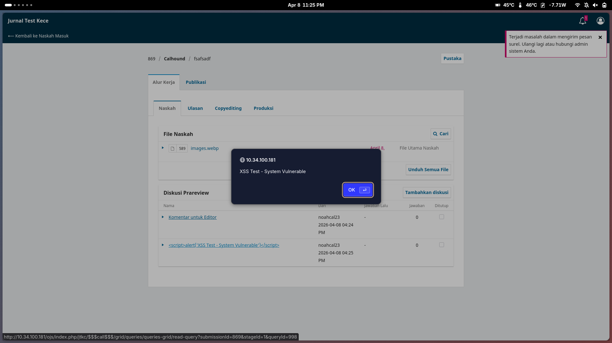
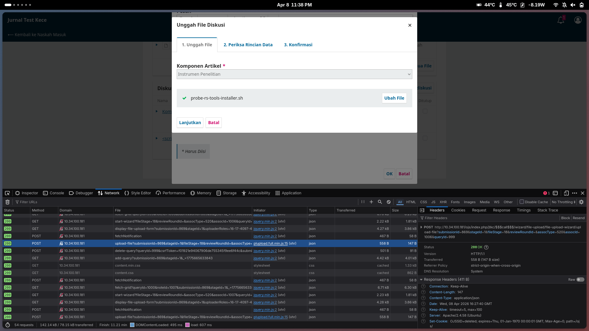
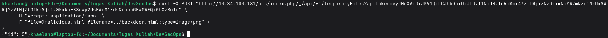

#### A. Authentication & Session

| No | Endpoint | Method | Deskripsi | Status | Evidence | Gambar | Potensi Kerentanan |
|---|---|---|---|---|---|---|---|
| A1 | `/index.php/index/login` | GET | Halaman login | 200 OK | Apache/2.4.58 (Ubuntu), OJS 3.3.0-8, Cookie OJSSESSID terdeteksi | - | **Information Disclosure:** Informasi versi server (Apache 2.4.58) dan CMS (OJS 3.3.0-8) terekspos melalui header dan meta tag. Hal ini memungkinkan attacker melakukan pencarian exploit (CVE) yang spesifik terhadap versi tersebut. Selain itu, cookie `OJSSESSID` berpotensi disalahgunakan jika tidak dilengkapi atribut keamanan. |
| A2 | `/index.php/index/login/signIn` | POST | Proses autentikasi | 200 OK | Stack teknologi identik (Apache, OJS, JQuery) | - | **Attack Surface Consistency:** Endpoint autentikasi menggunakan stack yang sama, sehingga kerentanan pada server atau CMS dapat langsung berdampak pada proses login. Risiko meningkat jika terdapat vulnerability yang belum di-patch. |
| A3 | `/index.php/index/login/lostPassword` | POST | Reset password | 200 OK | Title: Reset Password, OJS terdeteksi | - | **Sensitive Endpoint Exposure:** Endpoint reset password dapat dengan mudah diidentifikasi oleh attacker. Hal ini membuka peluang serangan seperti email enumeration atau brute force token reset jika tidak diamankan dengan baik. |
| A4 | `/index.php/index/user/register` | GET/POST | Registrasi user baru | 200 OK | Field password terdeteksi (password, password2) | - | **Automated Registration Attack:** Struktur form registrasi dapat dikenali oleh tools otomatis (bot), memungkinkan serangan mass registration atau spam jika tidak dilengkapi proteksi seperti CAPTCHA atau verifikasi email. |

#### B. File Upload
| No | Endpoint | Method | Deskripsi | Status | Evidence | Gambar | Potensi Kerentanan |
| :--- | :--- | :--- | :--- | :--- | :--- | :--- | :--- |
| B1 | `index.php/$journal/submission/wizard` | POST | Halaman untuk mengunggah naskah pada sebuah jurnal | 200 OK | [CVE-2024-25438](https://www.cve.org/CVERecord?id=CVE-2024-25438), [CVE-2022-26616](https://www.cve.org/CVERecord?id=CVE-2022-26616) |  | **Malicious File Upload & XSS:** Endpoint ini memiliki risiko tinggi karena memproses unggahan artikel dan input data diskusi. Kerentanan **CVE-2024-25438** memungkinkan attacker menyisipkan script berbahaya melalui field subjek pada fitur diskusi yang dapat dieksekusi di browser pengguna lain. Selain itu, **CVE-2022-26616** menunjukkan adanya celah reflected XSS melalui manipulasi HTTP header pada versi yang terdampak. Tanpa validasi ekstensi file dan sanitasi input yang ketat, endpoint ini dapat dimanfaatkan untuk mengambil alih sesi pengguna atau menjalankan kode arbitrer pada server. |
| B2 | `index.php/$journal/api/v1/submissions` | POST | Endpoint API untuk mengunggah naskah pada sebuah jurnal | 200 OK | Tidak ada validasi ekstensi file yang diupload |  | **Unrestricted File Upload:** Endpoint REST API `index.php/$journal/api/v1/submissions` hanya menangani inisiasi metadata, namun kerentanan ditemukan pada halaman `index.php/$journal/authorDashboard/submission/$submission`. Komponen unggah berkas pada halaman tersebut tidak menerapkan validasi tipe MIME dan kontrol ekstensi *server-side* yang ketat. Hal ini memungkinkan *attacker* mengunggah berkas dengan ekstensi berbahaya (seperti `.phtml` atau `.php`) yang dapat memicu eksekusi kode arbitrer atau serangan *stored XSS* pada peladen. |
| B3 | `index.php/index/admin/settings` | POST | Halaman konfigurasi jurnal | 200 OK | Tidak ada validasi ekstensi file yang diupload |  | **Path Traversal & Unrestricted File Upload:** Upaya eksploitasi *path traversal* pada endpoint `index.php/index/admin/settings` tidak dapat dilakukan karena sistem telah mengimplementasikan sanitasi ketat terhadap karakter manipulasi direktori pada parameter nama berkas. Meskipun proteksi terhadap jalur penyimpanan sudah memadai, endpoint ini masih memiliki celah keamanan karena tidak melakukan verifikasi terhadap ekstensi berkas yang diunggah. Hal ini memungkinkan pengguna dengan hak akses admin untuk mengunggah berkas dengan ekstensi berbahaya yang berpotensi memicu eksekusi kode arbitrer jika tersimpan di dalam direktori yang dapat diakses publik. |
| B4 | `index.php/index/admin/settings#plugins` | POST | Halaman manajemen plugin | - | [CVE-2024-56525](https://www.cve.org/CVERecord?id=CVE-2024-56525) | - | **Remote Code Execution & XXE:** Endpoint `index.php/index/admin/settings#plugins` memiliki risiko kritis terkait kerentanan **CVE-2024-56525**. Celah *XML External Entity* (XXE) ini memungkinkan pengguna dengan peran *Journal Editor* untuk mengunggah dokumen XML yang dimanipulasi melalui fitur *User XML Plugin*. Eksploitasi ini dapat digunakan untuk eskalasi hak akses menjadi *super admin* dan penanaman *backdoor* melalui plugin berbahaya. Tanpa pembaruan ke versi yang aman, fungsionalitas ini memberikan akses penuh bagi *attacker* untuk mengendalikan peladen dan menjalankan kode arbitrer secara jarak jauh. |

#### C. User Input / Reflected Data

| No | Endpoint | Method | Deskripsi | Status | Evidence | Gambar | Potensi Kerentanan |
|---|---|---|---|---|---|---|---|
| C1 | `/index.php/journal1/search` | GET | Pencarian artikel | 200 OK | Filter Aktif (Sanitized) |  | **Reflected XSS (Mitigated):** Percobaan injeksi script menggunakan payload `` dan `Attribute Injection` gagal dieksekusi. Aplikasi melakukan *HTML Encoding* pada karakter khusus (seperti `< > "`), sehingga payload hanya ditampilkan sebagai teks biasa di dalam atribut `value` pada form pencarian. Risiko saat ini rendah karena input telah dibersihkan sebelum dirender kembali ke browser. |
| C2 | `/index.php/journal1/issue/view/$id` | GET | Halaman issue | 200 OK | Stored XSS Sukses |  | **Stored XSS via Metadata:** Ditemukan celah keamanan di mana input pada metadata issue (seperti judul atau deskripsi issue) tidak difilter dengan benar. Payload `` yang dimasukkan berhasil tersimpan di database dan tereksekusi otomatis saat admin atau pengguna mengakses halaman manajemen issue. Hal ini berisiko pada pencurian session cookie admin atau pengalihan halaman secara paksa (open redirect). || C3 | `/index.php/$journal/article/view/$id` | GET | Halaman artikel | XSS via abstract |
| C3 | `/index.php/journal1/article/view/$id` | GET | Halaman artikel | N/A | Limited |  | **Stored XSS via Abstract (Potensial):** Payload `` telah berhasil diinjeksikan ke dalam kolom Abstrak pada bagian Metadata artikel. Meskipun pengujian eksekusi akhir (pop-up) terkendala oleh sistem publikasi OJS di lingkungan lab yang terkunci (*Unscheduled*), titik ini tetap diidentifikasi sebagai *attack surface* kritis. Jika artikel berhasil diterbitkan, script tersebut akan tereksekusi otomatis pada browser pembaca yang mengakses halaman abstrak tersebut. |
| C4 | Form profil user | POST | Edit profil | N/A | Limited |  | **Stored XSS via User Profile (Potensial):** Entry point ditemukan pada bagian profil publik pengguna (Tab *Public*). Payload `"><svg/onload=alert('Stored_XSS_Profil_C4')>` telah berhasil diinjeksikan ke dalam editor profil. Meskipun eksekusi visual (pop-up) tidak dapat dipicu secara langsung karena keterbatasan halaman publik pada environment lab (tidak ada artikel terbit/halaman editorial team), titik ini tetap diklasifikasikan sebagai *Attack Surface* yang berisiko tinggi karena data tersimpan permanen di database dan dapat menyerang pengguna lain yang berinteraksi dengan profil penyerang. |

#### D. REST API

| No | Endpoint | Method | Deskripsi | Status | Evidence | Gambar | Potensi Kerentanan |
|---|---|---|---|---|---|---|---|
| D1 | `/api/v1/users` | GET | Daftar user | 403 | Sistem membatasi akses endpoint API runtuk role tertentu |  | **IDOR:** User dapat mengakses data milik user lain dengan cara mengganti ID pada URL secara langsung. **Information Disclosure:** User dapat mengakses informasi yang seharusnya tidak bisa di dapatkan oleh role yang dimiliki|
| D2 | `/api/v1/submissions` | GET/POST | Manajemen submission | 403 | Sistem membatasi akses endpoint API runtuk role tertentu |  | **IDOR:** User dapat mengakses data milik user lain, dalam hal ini melihat submission dari author lain, dengan cara mengganti ID pada URL secara langsung. |
| D3 | `/api/v1/contexts` | GET | Daftar jurnal | 403 | Sistem membatasi akses endpoint API runtuk role tertentu |  | **IDOR:** User dapat melihat jurnal yang dimilki oleh user lain dengan cara mengganti ID pada URL secara langsung. **Information Disclosure:** User dapat mengakses informas yang seharusnya tidak bisa di dapatkan oleh role yang dimiliki. |

#### E. Admin Panel

| No | Endpoint | Method | Deskripsi | Status | Evidence | Gambar | Potensi Kerentanan |
|---|---|---|---|---|---|---|---|
| E1 | `/index.php/index/admin` | GET | Dashboard Admin | 302 | Server menolak akses langsung dan meminta autentikasi login | - | **Unauthorized Access (Brute Force Risk):** Pengambilalihan kendali penuh sistem jurnal berisiko terjadi melalui eksploitasi akun admin sebagai pemegang otoritas tertinggi. Tidak adanya mekanisme CAPTCHA memungkinkan serangan brute force untuk menebak kata sandi. Penggunaan protokol HTTP (tanpa enkripsi) juga membuka peluang credential sniffing. Dampaknya mencakup manipulasi data hingga penghapusan database oleh pihak tidak berwenang. |
| E2 | `/index.php/index/admin/settings#plugins` | GET / POST | Manajemen Plugin | 302 | Server menolak akses langsung dan meminta autentikasi login | - | **Remote Code Execution (RCE):** Jika akun admin berhasil dikompromikan, penyerang dapat memanfaatkan fitur "Upload A New Plugin" untuk mengunggah plugin berisi web shell. Hal ini dapat menyebabkan pengambilalihan penuh server dan kompromi seluruh data sistem. |
| E3 | `/index.php/index/admin/settings` | POST | Pengaturan Situs | 302 | Server menolak akses langsung dan meminta autentikasi login | - | **Security Misconfiguration:** Kesalahan konfigurasi pada fitur Site Settings (Site Setup, Appearance, Plugins) dapat menimbulkan risiko keamanan signifikan, terutama jika prinsip least privilege dan pembaruan sistem tidak diterapkan dengan baik. |
| E4 | `/index.php/index/admin/users` | GET / POST | Manajemen User | 404 | Resource tidak ditemukan, indikasi kemungkinan routing salah atau endpoint tersembunyi | - | **Privilege Escalation:** Jika celah ini dapat dieksploitasi, penyerang dapat memperoleh kendali penuh terhadap manajemen akun, termasuk ekstraksi data sensitif, penghapusan akun admin sah, serta pembuatan akun backdoor dengan hak akses tinggi secara permanen. |
