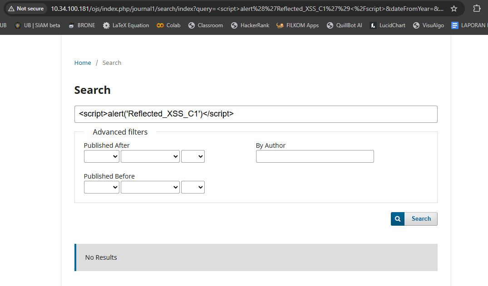
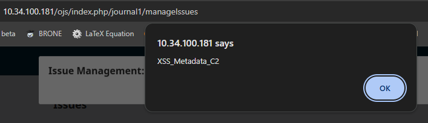
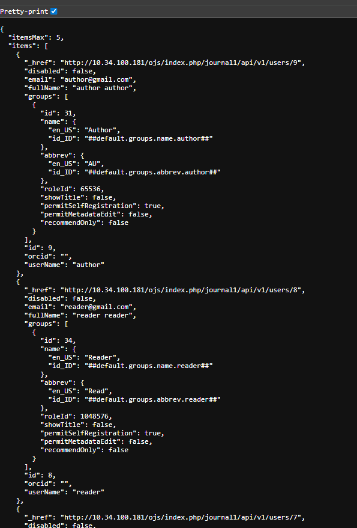
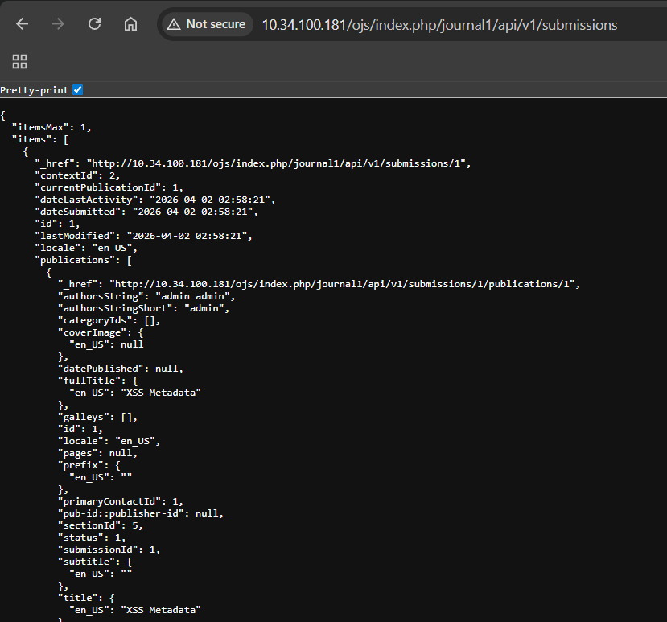
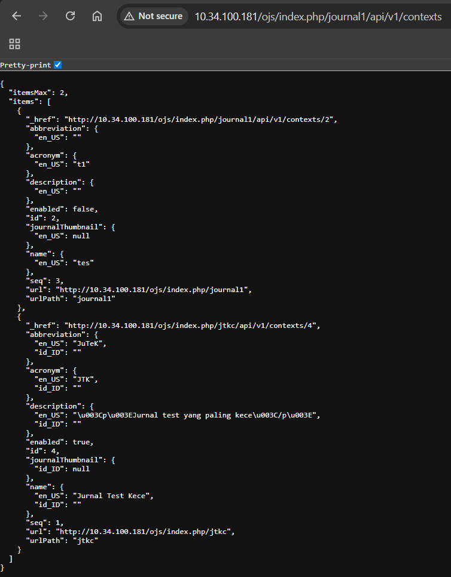

#### A. Authentication & Session

| No | Endpoint | Status | Teknologi Terdeteksi | Evidence | Potensi Kerentanan |
|---|---|---|---|---|---|
| B1 | `/index.php/index/login` | 200 OK | Apache 2.4.58, Ubuntu Linux, Bootstrap, JQuery, HTML5, OJS 3.3.0-8, Cookie (OJSSESSID) | MetaGenerator menunjukkan OJS version, HTTP header mengungkap server | **Information Disclosure:** Versi Apache dan OJS terungkap secara publik, memungkinkan attacker melakukan enumerasi CVE yang relevan. Selain itu, penggunaan cookie `OJSSESSID` tanpa atribut keamanan tambahan berpotensi terhadap session hijacking. |
| B2 | `/index.php/index/login/signIn` | 200 OK | Apache 2.4.58, Ubuntu Linux, JQuery, OJS 3.3.0-8 | Konsistensi fingerprint antar endpoint | **Attack Surface Mapping:** Endpoint autentikasi menggunakan stack yang sama, sehingga kerentanan pada server (Apache/OJS) berdampak langsung pada proses login. Risiko meningkat jika terdapat CVE yang belum di-patch. |
| B3 | `/index.php/index/login/lostPassword` | 200 OK | Apache 2.4.58, Ubuntu Linux, JQuery, OJS 3.3.0-8 | Title: "Reset Password" | **Sensitive Function Exposure:** Endpoint reset password terdeteksi secara publik dan dapat dipetakan oleh attacker untuk eksploitasi seperti brute force token atau email enumeration. |
| B4 | `/index.php/index/user/register` | 200 OK | Apache 2.4.58, Ubuntu Linux, JQuery, OJS 3.3.0-8, PasswordField[password,password2] | Form field terdeteksi oleh WhatWeb | **Automated Attack Risk:** Struktur form registrasi dapat dengan mudah dikenali oleh bot untuk melakukan mass registration atau spam account creation. |

#### C. User Input / Reflected Data

| No | Endpoint | Method | Deskripsi | Status | Evidence | Gambar | Potensi Kerentanan |
|---|---|---|---|---|---|---|---|
| C1 | `/index.php/journal1/search` | GET | Pencarian artikel | 200 OK | Filter Aktif (Sanitized) |  | **Reflected XSS (Mitigated):** Percobaan injeksi script menggunakan payload `` dan `Attribute Injection` gagal dieksekusi. Aplikasi melakukan *HTML Encoding* pada karakter khusus (seperti `< > "`), sehingga payload hanya ditampilkan sebagai teks biasa di dalam atribut `value` pada form pencarian. Risiko saat ini rendah karena input telah dibersihkan sebelum dirender kembali ke browser. |
| C2 | `/index.php/journal1/issue/view/$id` | GET | Halaman issue | 200 OK | Stored XSS Sukses |  | **Stored XSS via Metadata:** Ditemukan celah keamanan di mana input pada metadata issue (seperti judul atau deskripsi issue) tidak difilter dengan benar. Payload `` yang dimasukkan berhasil tersimpan di database dan tereksekusi otomatis saat admin atau pengguna mengakses halaman manajemen issue. Hal ini berisiko pada pencurian session cookie admin atau pengalihan halaman secara paksa (open redirect). || C3 | `/index.php/$journal/article/view/$id` | GET | Halaman artikel | XSS via abstract |
| C3 | `/index.php/journal1/article/view/$id` | GET | Halaman artikel | N/A | Limited |  | **Stored XSS via Abstract (Potensial):** Payload `` telah berhasil diinjeksikan ke dalam kolom Abstrak pada bagian Metadata artikel. Meskipun pengujian eksekusi akhir (pop-up) terkendala oleh sistem publikasi OJS di lingkungan lab yang terkunci (*Unscheduled*), titik ini tetap diidentifikasi sebagai *attack surface* kritis. Jika artikel berhasil diterbitkan, script tersebut akan tereksekusi otomatis pada browser pembaca yang mengakses halaman abstrak tersebut. |
| C4 | Form profil user | POST | Edit profil | N/A | Limited |  | **Stored XSS via User Profile (Potensial):** Entry point ditemukan pada bagian profil publik pengguna (Tab *Public*). Payload `"><svg/onload=alert('Stored_XSS_Profil_C4')>` telah berhasil diinjeksikan ke dalam editor profil. Meskipun eksekusi visual (pop-up) tidak dapat dipicu secara langsung karena keterbatasan halaman publik pada environment lab (tidak ada artikel terbit/halaman editorial team), titik ini tetap diklasifikasikan sebagai *Attack Surface* yang berisiko tinggi karena data tersimpan permanen di database dan dapat menyerang pengguna lain yang berinteraksi dengan profil penyerang. |

#### D. REST API

| No | Endpoint | Method | Deskripsi | Status | Evidence | Gambar | Potensi Kerentanan |
|---|---|---|---|---|---|---|---|
| D1 | `/api/v1/users` | GET | Daftar user | 403 | Sistem membatasi akses endpoint API runtuk role tertentu |  | **IDOR:** User dapat mengakses data milik user lain dengan cara mengganti ID pada URL secara langsung. **Information Disclosure:** User dapat mengakses informasi yang seharusnya tidak bisa di dapatkan oleh role yang dimiliki|
| D2 | `/api/v1/submissions` | GET/POST | Manajemen submission | 403 | Sistem membatasi akses endpoint API runtuk role tertentu |  | **IDOR:** User dapat mengakses data milik user lain, dalam hal ini melihat submission dari author lain, dengan cara mengganti ID pada URL secara langsung. |
| D3 | `/api/v1/contexts` | GET | Daftar jurnal | 403 | Sistem membatasi akses endpoint API runtuk role tertentu |  | **IDOR:** User dapat melihat jurnal yang dimilki oleh user lain dengan cara mengganti ID pada URL secara langsung. **Information Disclosure:** User dapat mengakses informas yang seharusnya tidak bisa di dapatkan oleh role yang dimiliki. |

#### E. Admin Panel

| No | Endpoint | Method | Deskripsi | Status | Evidence | Gambar | Potensi Kerentanan |
|---|---|---|---|---|---|---|---|
| E1 | `/index.php/index/admin` | GET | Dashboard Admin | 302 | Server menolak akses langsung dan meminta autentikasi login | - | **Unauthorized Access (Brute Force Risk):** Pengambilalihan kendali penuh sistem jurnal berisiko terjadi melalui eksploitasi akun admin sebagai pemegang otoritas tertinggi. Tidak adanya mekanisme CAPTCHA memungkinkan serangan brute force untuk menebak kata sandi. Penggunaan protokol HTTP (tanpa enkripsi) juga membuka peluang credential sniffing. Dampaknya mencakup manipulasi data hingga penghapusan database oleh pihak tidak berwenang. |
| E2 | `/index.php/index/admin/settings#plugins` | GET / POST | Manajemen Plugin | 302 | Server menolak akses langsung dan meminta autentikasi login | - | **Remote Code Execution (RCE):** Jika akun admin berhasil dikompromikan, penyerang dapat memanfaatkan fitur "Upload A New Plugin" untuk mengunggah plugin berisi web shell. Hal ini dapat menyebabkan pengambilalihan penuh server dan kompromi seluruh data sistem. |
| E3 | `/index.php/index/admin/settings` | POST | Pengaturan Situs | 302 | Server menolak akses langsung dan meminta autentikasi login | - | **Security Misconfiguration:** Kesalahan konfigurasi pada fitur Site Settings (Site Setup, Appearance, Plugins) dapat menimbulkan risiko keamanan signifikan, terutama jika prinsip least privilege dan pembaruan sistem tidak diterapkan dengan baik. |
| E4 | `/index.php/index/admin/users` | GET / POST | Manajemen User | 404 | Resource tidak ditemukan, indikasi kemungkinan routing salah atau endpoint tersembunyi | - | **Privilege Escalation:** Jika celah ini dapat dieksploitasi, penyerang dapat memperoleh kendali penuh terhadap manajemen akun, termasuk ekstraksi data sensitif, penghapusan akun admin sah, serta pembuatan akun backdoor dengan hak akses tinggi secara permanen. |
