# Laporan Temuan Keamanan Aplikasi OJS

# Temuan #01
| Field | Nilai |
|---|---|
| **Nama Kerentanan** | Missing Anti-Clickjacking Header (X-Frame-Options) |
| **Tool Penemu** | DAST |
| **Tool Spesifik** | Nikto 2.1.5, ZAP 2.17.0 |
| **URL / File** | `/ojs/` |
| **Method** | GET |
| **Response / Bukti** | Header X-Frame-Options dan Content-Security-Policy dengan directive frame-ancestors tidak ditemukan dalam respons HTTP |
| **OWASP Category** | A05:2021-Security Misconfiguration |
| **Severity (Raw)** | Medium |

**Screenshot:**
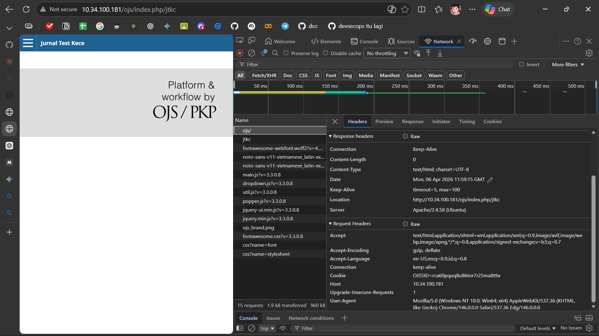

**Catatan:** Ketidakhadiran header ini memungkinkan situs dimuat dalam `<iframe>` pada domain lain, yang memfasilitasi serangan Clickjacking. Penyerang dapat menipu pengguna untuk melakukan aksi yang tidak diinginkan dengan menyembunyikan halaman asli di balik elemen yang tampak tidak berbahaya. Rekomendasi: Implementasikan header X-Frame-Options: DENY atau SAMEORIGIN, atau gunakan CSP dengan frame-ancestors directive.

---

# Temuan #02
| Field | Nilai |
|---|---|
| **Nama Kerentanan** | Cookie OJSSID Without HttpOnly Flag |
| **Tool Penemu** | DAST |
| **Tool Spesifik** | Nikto 2.1.5, ZAP 2.17.0 |
| **URL / File** | `/ojs/` |
| **Method** | GET |
| **Parameter** | Cookie: OJSSID |
| **Response / Bukti** | Cookie OJSSID dibuat tanpa flag HttpOnly dan Secure. Set-Cookie: OJSSID=<value> tanpa atribut HttpOnly |
| **OWASP Category** | A05:2021-Security Misconfiguration |
| **Severity (Raw)** | Medium |

**Screenshot:**

**Catatan:** Tanpa flag HttpOnly, session ID dapat diakses melalui skrip sisi klien (JavaScript). Hal ini meningkatkan risiko pencurian sesi jika terdapat kerentanan XSS. Cookie juga tidak menggunakan flag Secure yang berarti dapat dikirim melalui koneksi tidak terenkripsi. Rekomendasi: Tambahkan atribut HttpOnly, Secure, dan SameSite=Strict pada semua cookie sesi.

---

# Temuan #03
| Field | Nilai |
|---|---|
| **Nama Kerentanan** | Server Information Leak (Version & Inodes via ETags) |
| **Tool Penemu** | DAST |
| **Tool Spesifik** | Nikto 2.1.5, ZAP 2.17.0 |
| **URL / File** | `/ojs/robots.txt, /, /ojs/, dll.` |
| **Method** | GET |
| **Parameter** | HTTP Header: ETag, Server |
| **Response / Bukti** | Header Server menampilkan Apache/2.4.58 (Ubuntu). Header ETag mengandung nilai inode: 0x20 0x5cadc3ba77780 |
| **OWASP Category** | A05:2021-Security Misconfiguration |
| **Severity (Raw)** | Info |

**Screenshot:**
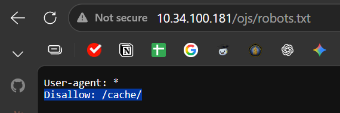

**Catatan:** Server memperlihatkan versi perangkat lunak dan sistem operasi yang digunakan melalui header Server dan ETag. Informasi ini dapat membantu penyerang mengidentifikasi kerentanan yang spesifik untuk versi tersebut. ETag yang mengandung nilai inode juga dapat membocorkan informasi sistem file internal. Rekomendasi: Konfigurasikan ServerTokens Prod dan ServerSignature Off pada Apache. Nonaktifkan ETag atau gunakan konfigurasi yang tidak mengungkapkan inode.

---

# Temuan #04
| Field | Nilai |
|---|---|
| **Nama Kerentanan** | Directory Indexing Enabled |
| **Tool Penemu** | DAST |
| **Tool Spesifik** | Nikto 2.1.5 |
| **URL / File** | `/ojs/cache/` |
| **Method** | GET |
| **Response / Bukti** | Server menampilkan daftar file dan direktori (Index of /cache/) saat mengakses URL tanpa file index |
| **OWASP Category** | A01:2021-Broken Access Control |
| **Severity (Raw)** | Medium |

**Screenshot:**

**Catatan:** Server memperbolehkan pendaftaran direktori (directory listing) yang memberikan akses publik untuk melihat struktur file dan file yang mungkin bersifat sensitif. Hal ini memungkinkan penyerang memetakan struktur aplikasi dan menemukan file konfigurasi, backup, atau data sensitif lainnya. Rekomendasi: Nonaktifkan directory indexing dengan menambahkan "Options -Indexes" pada konfigurasi Apache atau buat file index default di setiap direktori.

---

# Temuan #05
| Field | Nilai |
|---|---|
| **Nama Kerentanan** | Sensitive Path Exposure (robots.txt) |
| **Tool Penemu** | DAST |
| **Tool Spesifik** | Nikto 2.1.5 |
| **URL / File** | `/ojs/robots.txt` |
| **Method** | GET |
| **Response / Bukti** | File robots.txt tersedia publik dan berisi entri direktori yang mungkin sensitif |
| **OWASP Category** | A01:2021-Broken Access Control |
| **Severity (Raw)** | Info |

**Screenshot:**
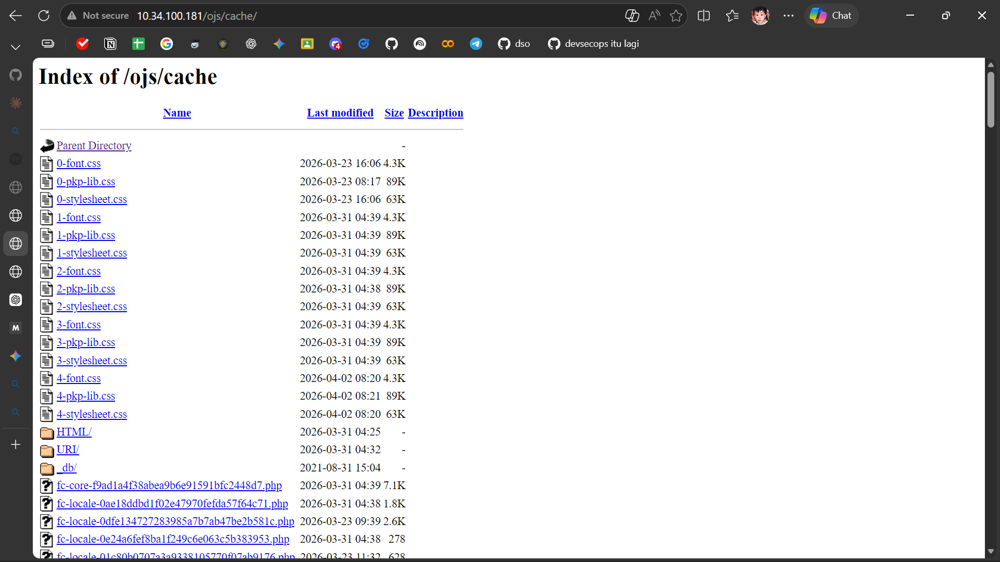

**Catatan:** Meskipun robots.txt dimaksudkan untuk mesin pencari, file ini sering kali membocorkan lokasi direktori tersembunyi atau path administratif yang seharusnya tidak diketahui publik. Penyerang dapat menggunakan informasi ini untuk menemukan area sensitif aplikasi. Rekomendasi: Tinjau kembali isi robots.txt dan pastikan tidak ada path sensitif yang terdaftar. Pertimbangkan untuk tidak menggunakan robots.txt sama sekali jika tidak diperlukan.

---

# Temuan #06
| Field | Nilai |
|---|---|
| **Nama Kerentanan** | Improper Access Control (Double Slash) |
| **Tool Penemu** | DAST |
| **Tool Spesifik** | Nikto 2.1.5 |
| **URL / File** | `/ojs//cache/` |
| **Method** | GET |
| **Response / Bukti** | Akses dengan double slash (//) pada URL mengembalikan kode status HTTP 200 OK |
| **OWASP Category** | A01:2021-Broken Access Control |
| **Severity (Raw)** | Info |

**Screenshot:**

**Catatan:** Akses melalui karakter slash ganda (//) tetap memberikan respons sukses, menunjukkan kelemahan dalam normalisasi path di sisi server. Hal ini dapat menyebabkan masalah dengan kontrol akses dan caching. Rekomendasi: Pastikan server melakukan normalisasi path dengan benar dan mengarahkan URL dengan double slash ke versi normalized-nya.

---

# Temuan #07
| Field | Nilai |
|---|---|
| **Nama Kerentanan** | Insecure HTTP Methods Enabled (OPTIONS) |
| **Tool Penemu** | DAST |
| **Tool Spesifik** | Nikto 2.1.5 |
| **URL / File** | `/ojs/` |
| **Method** | OPTIONS |
| **Response / Bukti** | Metode HTTP OPTIONS diizinkan. Respons menampilkan: Allowed HTTP Methods: OPTIONS, HEAD, GET, POST |
| **OWASP Category** | A05:2021-Security Misconfiguration |
| **Severity (Raw)** | Info |

**Screenshot:**
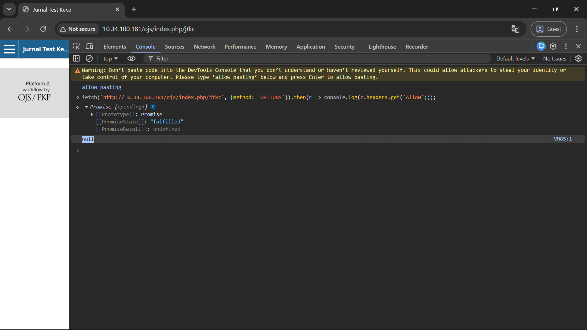

**Catatan:** Metode OPTIONS memberikan informasi mengenai metode HTTP lain yang didukung server. Hal ini membantu penyerang dalam tahap pengintaian (reconnaissance) untuk merencanakan serangan lebih lanjut. Rekomendasi: Nonaktifkan metode OPTIONS jika tidak diperlukan, atau pastikan respons tidak mengungkapkan metode yang tersedia.

---

# Temuan #08
| Field | Nilai |
|---|---|
| **Nama Kerentanan** | HTTP DEBUG Method Enabled |
| **Tool Penemu** | DAST |
| **Tool Spesifik** | Nikto 2.1.5 |
| **URL / File** | `/ojs/` |
| **Method** | DEBUG |
| **Response / Bukti** | Server merespons metode HTTP DEBUG yang dapat menampilkan informasi debugging server |
| **OWASP Category** | A05:2021-Security Misconfiguration |
| **Severity (Raw)** | Low |

**Screenshot:**
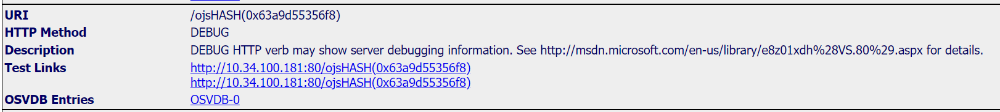

**Catatan:** Metode HTTP DEBUG aktif dan dapat digunakan untuk memicu keluaran informasi debugging server yang sensitif, seperti variabel sistem atau jalur file internal. Dalam lingkungan produksi, metode ini harus dimatikan. Rekomendasi: Nonaktifkan metode DEBUG pada konfigurasi server web.

---

# Temuan #09
| Field | Nilai |
|---|---|
| **Nama Kerentanan** | HTTP TRACK Method Active (Potential XST) |
| **Tool Penemu** | DAST |
| **Tool Spesifik** | Nikto 2.1.5 |
| **URL / File** | `/ojs/` |
| **Method** | TRACK |
| **Response / Bukti** | Metode HTTP TRACK aktif. Host rentan terhadap serangan Cross-Site Tracing (XST) |
| **OWASP Category** | A05:2021-Security Misconfiguration |
| **Severity (Raw)** | Medium |

**Screenshot:**
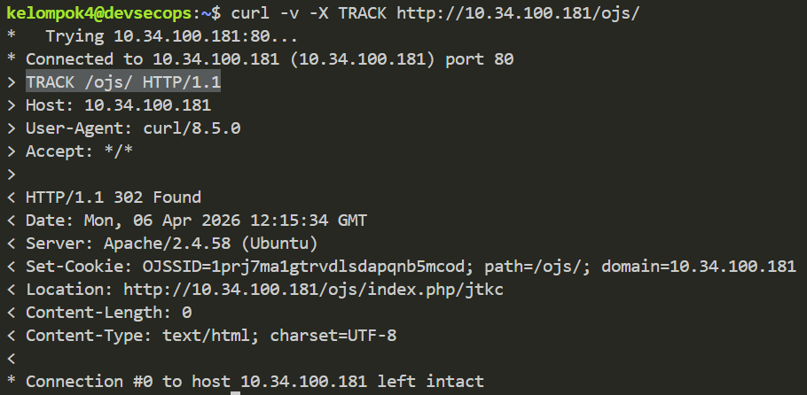

**Catatan:** Aktifnya metode TRACK memungkinkan penyerang melakukan teknik Cross-Site Tracing (XST) untuk memantulkan kembali header HTTP yang mengandung cookie sesi pengguna. Serangan XST dapat digunakan untuk mencuri cookie bahkan ketika HttpOnly flag aktif. Rekomendasi: Nonaktifkan metode TRACK pada konfigurasi server web.

---

# Temuan #10
| Field | Nilai |
|---|---|
| **Nama Kerentanan** | Multiple Directory Indexing Found |
| **Tool Penemu** | DAST |
| **Tool Spesifik** | Nikto 2.1.5 |
| **URL / File** | `/ojs/lib/, /ojs/tools/, /ojs/docs/, dll.` |
| **Method** | GET |
| **Response / Bukti** | Server menampilkan daftar file (Index of) pada multiple direktori: lib, tools, docs, cache, dan lainnya |
| **OWASP Category** | A01:2021-Broken Access Control |
| **Severity (Raw)** | Medium |

**Screenshot:**
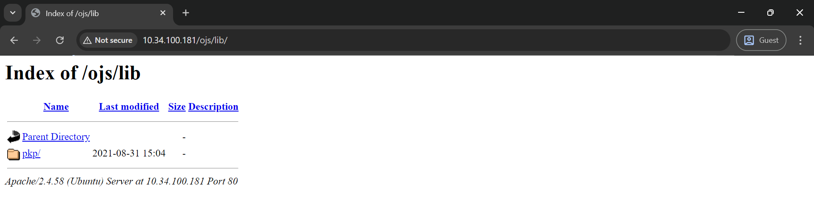
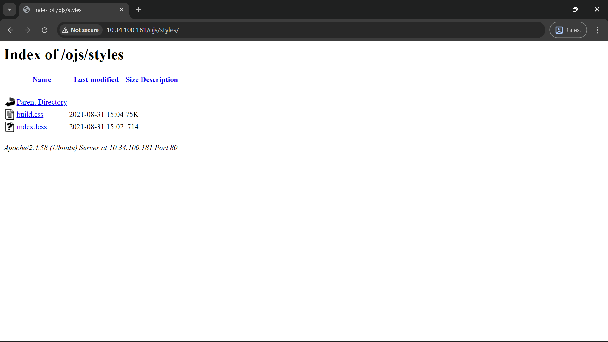
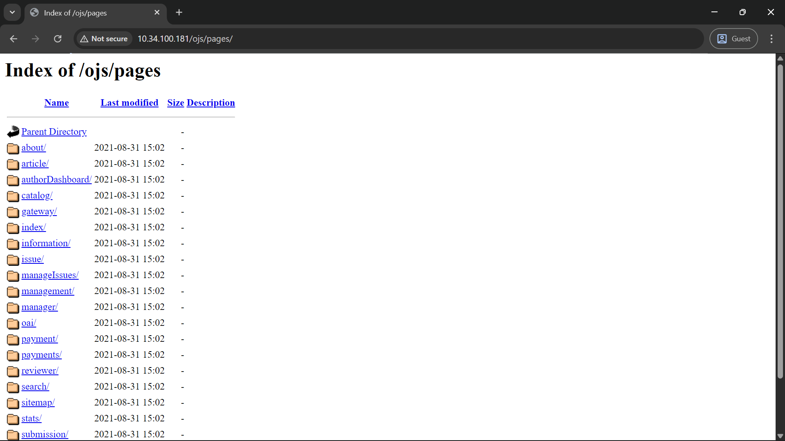
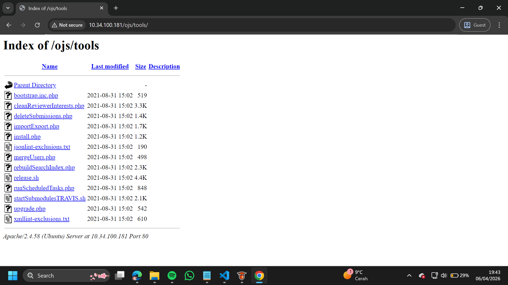
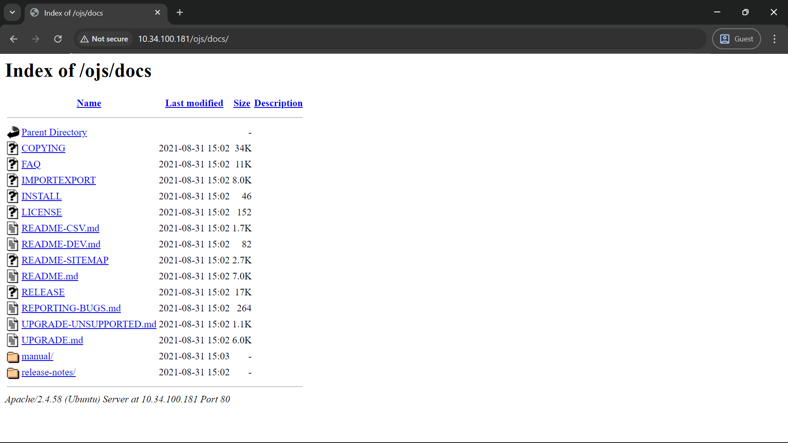

**Catatan:** Server dikonfigurasi untuk mengizinkan pendaftaran direktori (Directory Browsing) pada banyak lokasi. Hal ini memungkinkan pihak tidak berwenang untuk melihat struktur file internal, mengunduh file sensitif, dan memetakan komponen aplikasi secara detail yang seharusnya disembunyikan dari publik. Rekomendasi: Nonaktifkan directory indexing secara global dengan konfigurasi Options -Indexes pada Apache.

---

# Temuan #11
| Field | Nilai |
|---|---|
| **Nama Kerentanan** | Content Security Policy (CSP) Header Not Set |
| **Tool Penemu** | DAST |
| **Tool Spesifik** | ZAP 2.17.0 |
| **URL / File** | `/, /ojs/, /robots.txt, /sitemap.xml, /manual` |
| **Method** | GET |
| **Response / Bukti** | Header Content-Security-Policy tidak ditemukan dalam respons HTTP pada multiple endpoints |
| **OWASP Category** | A05:2021-Security Misconfiguration |
| **Severity (Raw)** | Medium |

**Screenshot:**

**Catatan:** Content Security Policy (CSP) adalah lapisan keamanan tambahan yang membantu mendeteksi dan mitigasi serangan Cross Site Scripting (XSS) dan data injection. Tanpa CSP, browser tidak memiliki panduan untuk memuat sumber daya dari origin yang diizinkan. Rekomendasi: Implementasikan header CSP dengan policy yang sesuai, contoh: Content-Security-Policy: default-src 'self'; script-src 'self'; style-src 'self' 'unsafe-inline'.

---

# Temuan #12
| Field | Nilai |
|---|---|
| **Nama Kerentanan** | HTTP Only Site (HTTPS Not Available) |
| **Tool Penemu** | DAST |
| **Tool Spesifik** | ZAP 2.17.0 |
| **URL / File** | `https://10.34.100.181/ojs/` |
| **Method** | GET |
| **Response / Bukti** | Koneksi ke https://10.34.100.181/ojs/ gagal. Server hanya melayani konten melalui HTTP tanpa enkripsi |
| **OWASP Category** | A02:2021-Cryptographic Failures |
| **Severity (Raw)** | Medium |

**Screenshot:**

**Catatan:** Situs hanya dilayani melalui HTTP tanpa enkripsi HTTPS. Hal ini memungkinkan serangan man-in-the-middle (MITM) di mana penyerang dapat menyadap, memodifikasi, atau mencuri data sensitif selama transmisi. Semua komunikasi termasuk cookie sesi dikirim dalam teks terbuka. Rekomendasi: Konfigurasikan server web untuk menggunakan SSL/TLS dengan sertifikat valid. Redirect semua permintaan HTTP ke HTTPS. Gunakan HSTS (HTTP Strict Transport Security) untuk memastikan browser selalu menggunakan HTTPS.

---

# Temuan #13
| Field | Nilai |
|---|---|
| **Nama Kerentanan** | Cookie without SameSite Attribute |
| **Tool Penemu** | DAST |
| **Tool Spesifik** | ZAP 2.17.0 |
| **URL / File** | `/ojs/` |
| **Method** | GET |
| **Parameter** | Cookie: OJSSID |
| **Response / Bukti** | Cookie OJSSID dibuat tanpa atribut SameSite. Set-Cookie: OJSSID tanpa SameSite |
| **OWASP Category** | A05:2021-Security Misconfiguration |
| **Severity (Raw)** | Low |

**Screenshot:**

**Catatan:** Cookie dibuat tanpa atribut SameSite, yang berarti cookie dapat dikirim sebagai hasil dari permintaan cross-site. Atribut SameSite adalah mekanisme perlindungan efektif terhadap serangan Cross-Site Request Forgery (CSRF), cross-site script inclusion, dan timing attacks. Rekomendasi: Pastikan atribut SameSite diatur ke 'lax' atau 'strict' untuk semua cookie. Contoh: Set-Cookie: OJSSID=<value>; SameSite=Strict; HttpOnly; Secure.

---

# Temuan #14
| Field | Nilai |
|---|---|
| **Nama Kerentanan** | Cross-Origin-Embedder-Policy Header Missing or Invalid |
| **Tool Penemu** | DAST |
| **Tool Spesifik** | ZAP 2.17.0 |
| **URL / File** | `/, /ojs/` |
| **Method** | GET |
| **Parameter** | Cross-Origin-Embedder-Policy |
| **Response / Bukti** | Header Cross-Origin-Embedder-Policy tidak ditemukan dalam respons HTTP |
| **OWASP Category** | A05:2021-Security Misconfiguration |
| **Severity (Raw)** | Low |

**Screenshot:**

**Catatan:** Header Cross-Origin-Embedder-Policy (COEP) mencegah dokumen memuat sumber daya cross-origin yang tidak secara eksplisit memberikan izin (menggunakan CORP atau CORS). Header ini penting untuk mengaktifkan fitur browser seperti SharedArrayBuffer dan melindungi dari serangan side-channel seperti Spectre. Rekomendasi: Konfigurasikan header COEP dengan nilai require-corp: Cross-Origin-Embedder-Policy: require-corp.

---

# Temuan #15
| Field | Nilai |
|---|---|
| **Nama Kerentanan** | Cross-Origin-Opener-Policy Header Missing or Invalid |
| **Tool Penemu** | DAST |
| **Tool Spesifik** | ZAP 2.17.0 |
| **URL / File** | `/, /ojs/` |
| **Method** | GET |
| **Parameter** | Cross-Origin-Opener-Policy |
| **Response / Bukti** | Header Cross-Origin-Opener-Policy tidak ditemukan dalam respons HTTP |
| **OWASP Category** | A05:2021-Security Misconfiguration |
| **Severity (Raw)** | Low |

**Screenshot:**

**Catatan:** Header Cross-Origin-Opener-Policy (COOP) memungkinkan situs untuk mengontrol apakah dokumen lain dapat berbagi browsing context. Berbagi browsing context dengan dokumen tidak tepercaya dapat menyebabkan kebocoran data. Header ini melindungi dari serangan cross-origin window manipulation. Rekomendasi: Konfigurasikan header COOP dengan nilai same-origin: Cross-Origin-Opener-Policy: same-origin. Hindari menggunakan same-origin-allow-popups karena kurang aman.

---

# Temuan #16
| Field | Nilai |
|---|---|
| **Nama Kerentanan** | Cross-Origin-Resource-Policy Header Missing or Invalid |
| **Tool Penemu** | DAST |
| **Tool Spesifik** | ZAP 2.17.0 |
| **URL / File** | `/, /icons/ubuntu-logo.png, /ojs/` |
| **Method** | GET |
| **Parameter** | Cross-Origin-Resource-Policy |
| **Response / Bukti** | Header Cross-Origin-Resource-Policy tidak ditemukan pada halaman web dan sumber daya statis |
| **OWASP Category** | A05:2021-Security Misconfiguration |
| **Severity (Raw)** | Low |

**Screenshot:**

**Catatan:** Header Cross-Origin-Resource-Policy (CORP) adalah header opt-in yang dirancang untuk melawan serangan side-channel seperti Spectre. Sumber daya harus secara spesifik diatur sebagai dapat dibagikan di antara origin yang berbeda. Tanpa CORP, sumber daya dapat dimuat oleh origin lain tanpa izin. Rekomendasi: Konfigurasikan header CORP dengan nilai same-origin untuk halaman web: Cross-Origin-Resource-Policy: same-origin. Jika sumber daya harus dibagikan, gunakan nilai cross-origin.

---

# Temuan #17
| Field | Nilai |
|---|---|
| **Nama Kerentanan** | In Page Banner Information Leak |
| **Tool Penemu** | DAST |
| **Tool Spesifik** | ZAP 2.17.0 |
| **URL / File** | `/manual, /robots.txt, /sitemap.xml, /usr/share/doc/apache2/README.Debian.gz, /var/www/html/index.html` |
| **Method** | GET |
| **Response / Bukti** | Server mengembalikan string banner versi Apache/2.4.58 dalam konten respons halaman |
| **OWASP Category** | A05:2021-Security Misconfiguration |
| **Severity (Raw)** | Low |

**Screenshot:**

**Catatan:** Server menampilkan informasi versi perangkat lunak dalam konten halaman (in-page banner). Kebocoran informasi ini memungkinkan penyerang untuk menargetkan masalah spesifik yang memengaruhi produk dan versi yang digunakan. Informasi ini sering muncul pada halaman error default, footer, atau dokumentasi. Rekomendasi: Konfigurasikan Apache dengan ServerTokens Prod dan ServerSignature Off. Hapus atau sesuaikan halaman error default yang mengandung informasi versi.

---

# Temuan #18
| Field | Nilai |
|---|---|
| **Nama Kerentanan** | Permissions Policy Header Not Set |
| **Tool Penemu** | DAST |
| **Tool Spesifik** | ZAP 2.17.0 |
| **URL / File** | `/, /manual, /ojs/, /robots.txt, /sitemap.xml` |
| **Method** | GET |
| **Response / Bukti** | Header Permissions-Policy tidak ditemukan dalam respons HTTP pada multiple endpoints |
| **OWASP Category** | A05:2021-Security Misconfiguration |
| **Severity (Raw)** | Low |

**Screenshot:**

**Catatan:** Permissions Policy Header adalah lapisan keamanan tambahan yang membatasi akses fitur browser seperti kamera, mikrofon, lokasi, fullscreen, payment, dan lainnya. Header ini melindungi privasi pengguna dengan membatasi fitur yang dapat digunakan oleh sumber daya web, mencegah penyalahgunaan fitur sensitif oleh skrip berbahaya. Rekomendasi: Implementasikan header Permissions-Policy dengan kebijakan yang sesuai, contoh: Permissions-Policy: camera=(), microphone=(), geolocation=(), payment=().

---

# Temuan #19
| Field | Nilai |
|---|---|
| **Nama Kerentanan** | X-Content-Type-Options Header Missing |
| **Tool Penemu** | DAST |
| **Tool Spesifik** | ZAP 2.17.0 |
| **URL / File** | `/, /icons/ubuntu-logo.png, /ojs/` |
| **Method** | GET |
| **Parameter** | x-content-type-options |
| **Response / Bukti** | Header X-Content-Type-Options tidak diatur ke nosniff pada halaman web dan sumber daya gambar |
| **OWASP Category** | A05:2021-Security Misconfiguration |
| **Severity (Raw)** | Low |

**Screenshot:**

**Catatan:** Header X-Content-Type-Options tidak diatur ke nosniff. Hal ini memungkinkan browser melakukan MIME-sniffing pada body respons, berpotensi menyebabkan respons diinterpretasikan sebagai tipe konten yang berbeda dari yang dideklarasikan. Misalnya, file yang seharusnya tidak dieksekusi dapat dijalankan sebagai skrip. Rekomendasi: Pastikan server mengatur header X-Content-Type-Options: nosniff untuk semua halaman web dan sumber daya statis.

---

# Temuan #20
| Field | Nilai |
|---|---|
| **Nama Kerentanan** | Cookie Slack Detector |
| **Tool Penemu** | DAST |
| **Tool Spesifik** | ZAP 2.17.0 |
| **URL / File** | `/ojs/` |
| **Method** | GET |
| **Response / Bukti** | Cookie OJSSID tidak mempengaruhi respons saat dihapus, menunjukkan autentikasi mungkin tidak ditegakkan dengan benar |
| **OWASP Category** | A05:2021-Security Misconfiguration |
| **Severity (Raw)** | Info |

**Screenshot:**

**Catatan:** Pengujian menunjukkan bahwa cookie OJSSID tidak memiliki efek yang diharapkan pada respons. Ini dapat mengindikasikan bahwa autentikasi berbasis cookie tidak ditegakkan dengan benar di semua area aplikasi, atau ada mekanisme autentikasi lain yang lebih dominan. Ini adalah temuan informasional yang memerlukan investigasi lebih lanjut untuk memastikan kontrol akses berfungsi dengan benar.

---

# Temuan #21
| Field | Nilai |
|---|---|
| **Nama Kerentanan** | Information Disclosure - Suspicious Comments |
| **Tool Penemu** | DAST |
| **Tool Spesifik** | ZAP 2.17.0 |
| **URL / File** | `/` |
| **Method** | GET |
| **Response / Bukti** | Komentar HTML mencurigakan ditemukan: Modified from the Debian original for Ubuntu, Last updated: 2022-03-22, https://launchpad.net/bugs/1966004 |
| **OWASP Category** | A05:2021-Security Misconfiguration |
| **Severity (Raw)** | Info |

**Screenshot:**

**Catatan:** Respons mengandung komentar mencurigakan yang dapat membantu penyerang. Komentar dalam kode sumber terkadang mengungkapkan informasi sensitif tentang struktur aplikasi, path file, bug yang diketahui, atau detail implementasi. Dalam kasus ini, komentar mengungkapkan bahwa halaman dimodifikasi dari template Debian dan mengandung referensi ke bug tracking. Rekomendasi: Hapus semua komentar yang mengandung informasi berharga bagi penyerang sebelum deployment ke produksi.

---

# Temuan #22
| Field | Nilai |
|---|---|
| **Nama Kerentanan** | Modern Web Application |
| **Tool Penemu** | DAST |
| **Tool Spesifik** | ZAP 2.17.0 |
| **URL / File** | `/ojs/` |
| **Method** | GET |
| **Response / Bukti** | Aplikasi terdeteksi sebagai aplikasi web modern dengan elemen dinamis:  |
| **OWASP Category** | N/A |
| **Severity (Raw)** | Info |

**Screenshot:**

**Catatan:** Aplikasi terdeteksi sebagai aplikasi web modern dengan elemen dinamis. Ini adalah temuan informasional yang menyarankan penggunaan Ajax Spider untuk eksplorasi otomatis yang lebih efektif dibandingkan spider standar. Tidak ada kerentanan yang terkait dengan temuan ini. ZAP merekomendasikan untuk menggunakan Ajax Spider jika perlu eksplorasi otomatis lebih lanjut.

---

# Temuan #23
| Field | Nilai |
|---|---|
| **Nama Kerentanan** | Session Management Response Identified |
| **Tool Penemu** | DAST |
| **Tool Spesifik** | ZAP 2.17.0 |
| **URL / File** | `/ojs/` |
| **Method** | GET |
| **Parameter** | OJSSID |
| **Response / Bukti** | Respons mengandung token manajemen sesi: cookie:OJSSID |
| **OWASP Category** | N/A |
| **Severity (Raw)** | Info |

**Screenshot:**

**Catatan:** Respons telah diidentifikasi mengandung token manajemen sesi. Ini adalah temuan informasional yang mengidentifikasi metode manajemen sesi yang digunakan aplikasi (berbasis cookie dengan nama OJSSID). Temuan ini membantu ZAP mengkonfigurasi metode manajemen sesi secara otomatis. Tidak ada tindakan perbaikan yang diperlukan untuk temuan ini.

---

# Temuan #24
| Field | Nilai |
|---|---|
| **Nama Kerentanan** | Storable and Cacheable Content |
| **Tool Penemu** | DAST |
| **Tool Spesifik** | ZAP 2.17.0 |
| **URL / File** | `/manual, /ojs, /ojs/, /robots.txt, /sitemap.xml` |
| **Method** | GET |
| **Response / Bukti** | Konten respons dapat disimpan oleh komponen caching. Tidak ada directive caching yang secara eksplisit ditentukan |
| **OWASP Category** | A05:2021-Security Misconfiguration |
| **Severity (Raw)** | Info |

**Screenshot:**

**Catatan:** Konten respons dapat disimpan oleh komponen caching seperti proxy server karena tidak ada directive caching yang secara eksplisit ditentukan. Dalam ketiadaan lifetime caching yang eksplisit, heuristic lifetime liberal 1 tahun diasumsikan (sesuai RFC 7234). Jika data respons sensitif atau spesifik pengguna, ini dapat menyebabkan kebocoran informasi sensitif melalui cache yang dibagikan. Rekomendasi: Untuk konten sensitif, gunakan header: Cache-Control: no-cache, no-store, must-revalidate, private dan Pragma: no-cache.

---

# Temuan #25
| Field | Nilai |
|---|---|
| **Nama Kerentanan** | User Agent Fuzzer |
| **Tool Penemu** | DAST |
| **Tool Spesifik** | ZAP 2.17.0 |
| **URL / File** | `/ojs` |
| **Method** | GET |
| **Parameter** | Header User-Agent |
| **Response / Bukti** | Pengujian dengan berbagai User-Agent string (MSIE 6.0, MSIE 7.0, MSIE 8.0, Trident/7.0, Edge/75.0) dilakukan untuk mendeteksi perbedaan konten |
| **OWASP Category** | N/A |
| **Severity (Raw)** | Info |

**Screenshot:**

**Catatan:** Temuan informasional dari pengujian fuzzing User-Agent. ZAP menguji respons dengan berbagai User-Agent string untuk mendeteksi perbedaan konten berdasarkan klien (misalnya, situs mobile, akses sebagai Search Engine Crawler). Perbandingan dilakukan terhadap status code dan hash respons. Tidak ada kerentanan yang dikonfirmasi dari temuan ini. Ini adalah bagian dari pengujian aktif untuk mengidentifikasi potensi diskriminasi konten.

---

## Temuan #26

| Field | Nilai |
|---|---|
| **Nama Kerentanan** | Server-Side Request Forgery (SSRF) |
| **Tool Penemu** | DAST / Manual |
| **Tool Spesifik** | CVE-2021-27188 (Akismet Plugin Exploration) |
| **URL / File** | `/index.php/journal1/management/settings/website` |
| **Parameter / Baris Kode** | Akismet API Server URL |
| **Method** | POST |
| **Payload** | `https://webhook.site/a268575c-35e5-4d76-851b-220c7276c242` |
| **Response / Bukti** | HTTP GET Request diterima oleh Webhook.site dari IP Server OJS |
| **OWASP Category** | A10:2021 – Server-Side Request Forgery (SSRF) |
| **Severity (Raw)** | High |

### Screenshot / Bukti
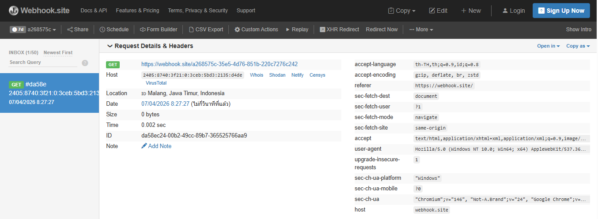

### Catatan
Kerentanan ini ditemukan pada fitur plugin Akismet di OJS versi 3.3.0-8. Aplikasi memungkinkan pengguna dengan hak akses Manager/Editor untuk menentukan URL server Akismet secara kustom. Namun, aplikasi tidak melakukan validasi atau pembatasan terhadap URL yang dimasukkan (tidak ada *allowlist*). 

Penyerang dapat memasukkan URL yang mengarah ke infrastruktur eksternal (seperti Webhook.site) atau bahkan ke layanan internal server (localhost) untuk memetakan port atau mencuri data sensitif. Bukti di atas menunjukkan server OJS melakukan *outbound request* secara otomatis ke server pengontrol yang ditentukan penyerang setelah pengaturan disimpan.

---

## Temuan #27

| Field | Nilai |
|---|---|
| **Nama Kerentanan** | Reflected Cross-Site Scripting (XSS) - Mitigated |
| **Tool Penemu** | Manual |
| **Tool Spesifik** | Browser DevTools (Console) & Manual Injection |
| **URL / File** | `/index.php/journal1/search` |
| **Parameter / Baris Kode** | `query` |
| **Method** | GET |
| **Payload** | `` |
| **Response / Bukti** | Input ter-encode (Sanitized) |
| **OWASP Category** | A03:2021 – Injection |
| **Severity (Raw)** | Low |

### Screenshot / Bukti

### Catatan
Pengujian dilakukan pada fitur pencarian artikel. Meskipun parameter `query` menerima input script, aplikasi OJS versi ini telah menerapkan *HTML Encoding* pada karakter khusus (seperti `<` menjadi `&lt;`). Script tidak tereksekusi di browser dan hanya ditampilkan sebagai teks biasa di dalam atribut `value` form pencarian.

---

## Temuan #28

| Field | Nilai |
|---|---|
| **Nama Kerentanan** | Stored Cross-Site Scripting (XSS) via Metadata Abstract |
| **Tool Penemu** | Manual |
| **Tool Spesifik** | OJS Submission Workflow |
| **URL / File** | `/index.php/journal1/article/view/$id` |
| **Parameter / Baris Kode** | Kolom "Abstract" pada Metadata Artikel |
| **Method** | POST |
| **Payload** | `` |
| **Response / Bukti** | Payload tersimpan di Database (Stored) |
| **OWASP Category** | A03:2021 – Injection |
| **Severity (Raw)** | Medium (Potential High) |

### Screenshot / Bukti
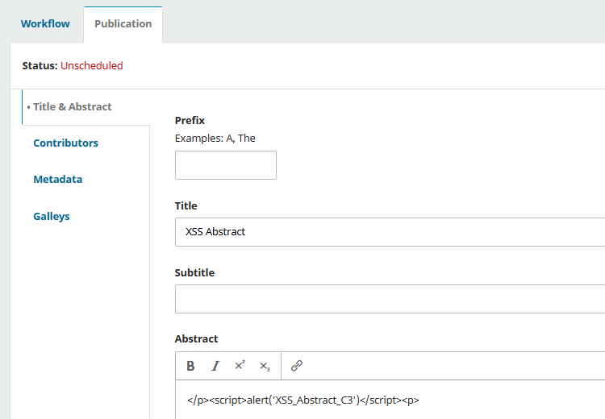

### Catatan
Ditemukan celah *Stored XSS* pada input Abstrak artikel. Payload berhasil masuk dan tersimpan permanen di database tanpa filter yang ketat di sisi server. Kendala pada sistem publikasi lab (*Unscheduled status*) menghambat eksekusi visual (pop-up), namun secara teknis ini merupakan *attack surface* kritis karena script akan otomatis aktif saat artikel diakses oleh publik setelah statusnya berubah menjadi *Published*.

---

## Temuan #29

| Field | Nilai |
|---|---|
| **Nama Kerentanan** | Stored Cross-Site Scripting (XSS) via User Profile |
| **Tool Penemu** | Manual |
| **Tool Spesifik** | User Profile Management |
| **URL / File** | `/index.php/journal1/user/profile` (Tab Public) |
| **Parameter / Baris Kode** | Kolom "Affiliation" / "Bio Statement" |
| **Method** | POST |
| **Payload** | `"><svg/onload=alert('Stored_XSS_Profil_C4')>` |
| **Response / Bukti** | Payload tersimpan di Database (Stored) |
| **OWASP Category** | A03:2021 – Injection |
| **Severity (Raw)** | High |

### Screenshot / Bukti
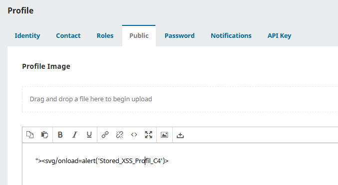

### Catatan
Injeksi *Stored XSS* berhasil dilakukan pada formulir profil pengguna. Penggunaan payload berbasis `svg` bertujuan untuk memicu eksekusi otomatis saat elemen dirender. Meskipun halaman profil publik tidak dapat diakses langsung karena keterbatasan konfigurasi jurnal di lab, risiko temuan ini sangat tinggi karena dapat dimanfaatkan untuk mencuri *session cookie* administrator lain atau pembaca yang melihat informasi profil penyerang.
