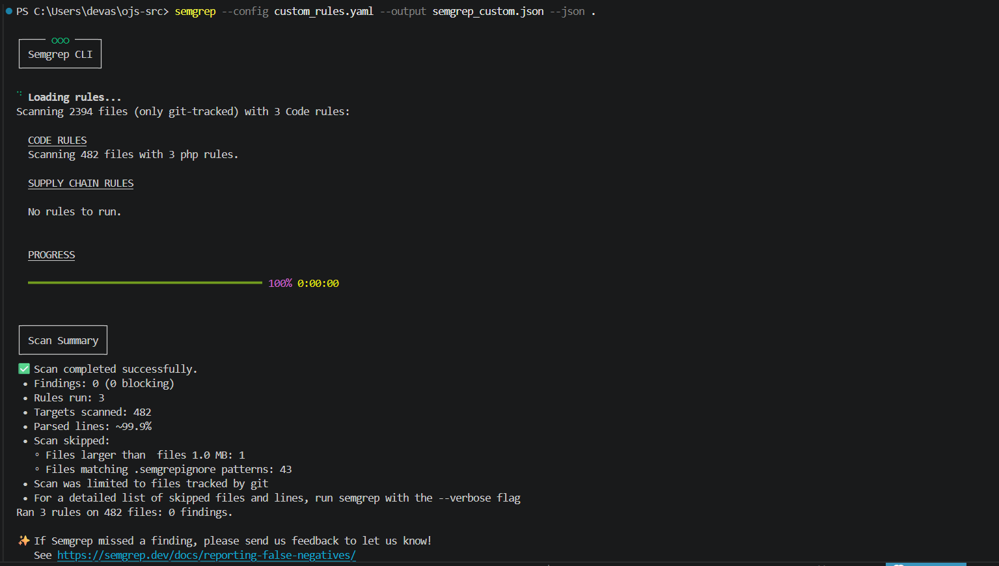

# SAST Deduplikasi (Semgrep)

Tanggal analisis: 2026-04-09

## Ringkasan Hasil

| Metrik | Nilai |
|---|---:|
| Total temuan mentah | 0 |
| Duplikasi antar laporan | 0 |
| False positive yang dihapus | 0 |
| Total temuan valid (final) | 0 |

## Sumber Data

- semgrep_custom.json
- semgrep_owasp.json
- semgrep_php.json

Ketiga file JSON di atas memiliki field results dengan jumlah 0, sehingga tidak ada item yang bisa dideduplikasi maupun diklasifikasikan sebagai false positive.

## Kenapa Tidak Ada Temuan Setelah Deduplikasi

1. Hasil scan Semgrep menunjukkan 0 findings pada report JSON.
2. Karena tidak ada finding mentah, proses deduplikasi tidak menghasilkan penghapusan apa pun.
3. Validasi screenshot juga konsisten: Scan completed successfully dan Findings: 0.
4. Pada salah satu output juga terlihat hanya aturan OSS yang aktif. Ini bisa menurunkan cakupan deteksi dibanding rule set yang lebih luas.

## Bukti Gambar

### Gambar 1 - Hasil scan Semgrep

Keterangan validasi Gambar 1:
- Scan completed successfully.
- Findings: 0 (0 blocking).

### Gambar 2 - Hasil scan Semgrep (run tambahan)

Path target gambar: screenshot/02.png

Catatan: file gambar kedua belum tersedia di repository saat ini, jadi belum bisa ditampilkan.

## Catatan

Status nol temuan bukan berarti sistem pasti aman 100 persen. Ini berarti pada konfigurasi rule dan cakupan scan saat ini, Semgrep tidak menemukan pola kerentanan yang terdeteksi.
